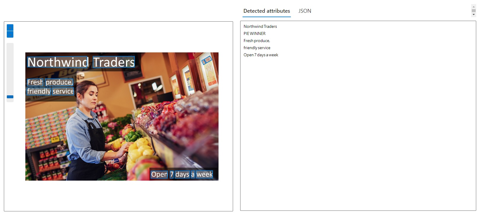
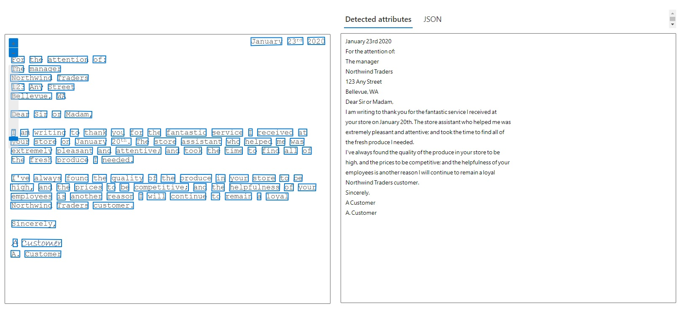

# Laboratório de OCR com Azure Cognitive Services

## Resumo

Documento destaca os aprendizados e experiências do laboratório de Reconhecimento Óptico de Caracteres (OCR) usando Azure Cognitive Services, demonstrando a eficácia do OCR para extrair texto de imagens e documentos com desafio de projeto da DIO.

## Processo

1. **Configuração**: Criação de um recurso Azure Cognitive Services no portal Azure.
2. **Implementação do OCR**: Uso da SDK do Azure para enviar imagens ao serviço de OCR e análise das respostas. As imagens utilizadas nessa etapa foram fornecidas no laboratório [ ocr-images.zip](https://aka.ms/mslearn-ocr-images)
- 
- 
3. **Resultados**: Avaliação da precisão do texto extraído.
- 
- 

## Insights Principais

- **Qualidade da Imagem**: A qualidade da imagem é crucial para a precisão do OCR. Imagens claras e bem iluminadas produzem melhores resultados.
- **Aplicações Versáteis**: O OCR pode ser aplicado tanto na digitalização de documentos como também na assistência para pessoas com deficiência visual.

